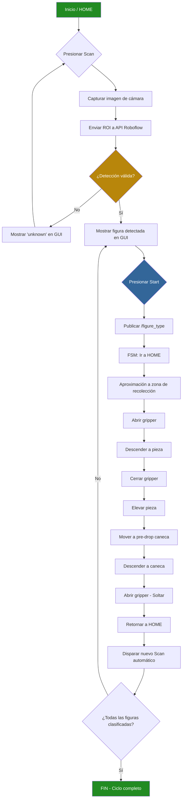
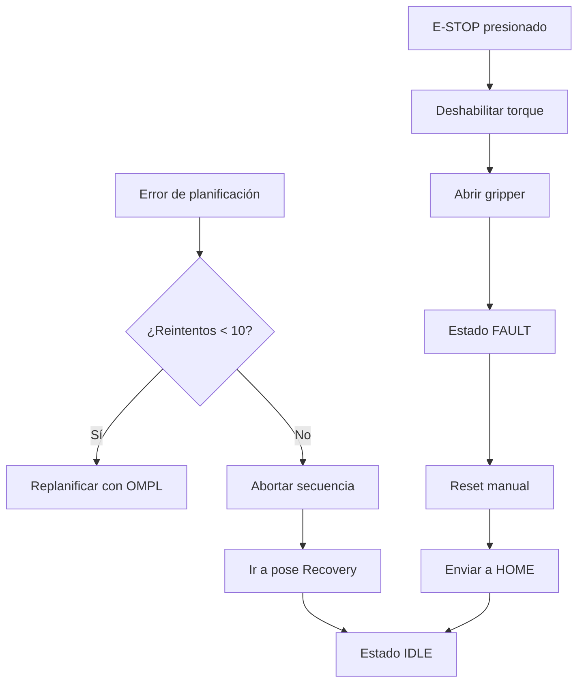
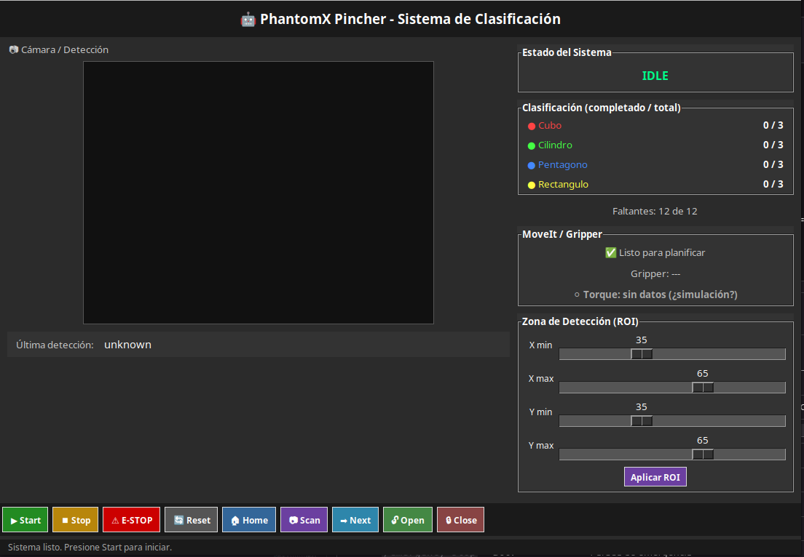
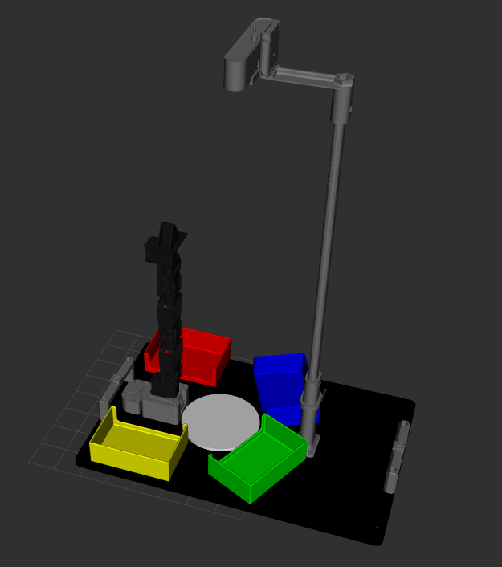
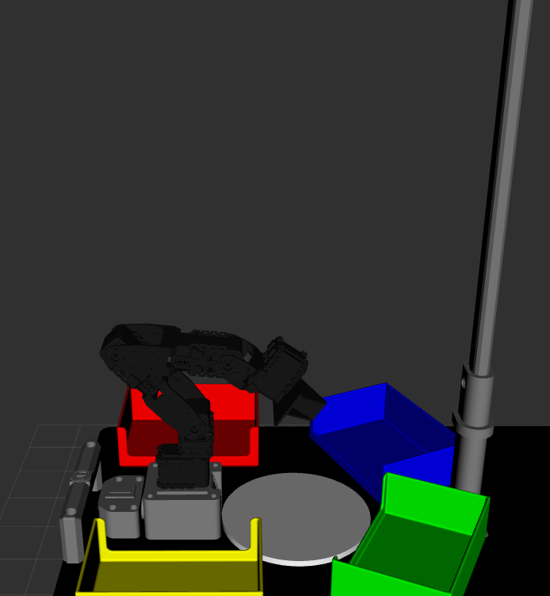

# Proyecto Final - Robótica 2026-I

## Clasificación Automatizada de Figuras Geométricas con PhantomX Pincher X100

Proyecto de clasificación automatizada utilizando el robot **PhantomX Pincher X100**, visión de máquina mediante **API de Roboflow** (Object Detection), planificación de trayectorias con **MoveIt 2** y **ROS 2 Jazzy** sobre Ubuntu 24.04.

## Equipo

- Duvan Tique

---

## 1. Descripción de la Solución y Alcance

### 1.1 Problema

Clasificar automáticamente figuras geométricas (cubo, cilindro, pentágono y rectángulo) depositadas sobre una bandeja de recolección y transportarlas mediante un brazo robótico de 4 GDL hasta la caneca correspondiente según su forma.

### 1.2 Solución Implementada

Se desarrolló un sistema integrado que combina:

- **Visión por computador**: una cámara USB captura la zona de recolección y mediante la API REST de Roboflow (modelo de Object Detection) se identifica la figura presente.
- **Planificación de movimiento**: MoveIt 2 con OMPL genera trayectorias libres de colisión desde la posición de recolección hasta cada caneca.
- **Control de hardware**: un nodo Python se comunica con los motores Dynamixel AX-12A del robot real a través del protocolo 1.0, ejecutando las trayectorias punto a punto.
- **Interfaz gráfica (GUI)**: una aplicación Tkinter permite al operador supervisar el proceso, disparar escaneos, iniciar ciclos y activar la parada de emergencia.

### 1.3 Alcance Real Logrado

| Funcionalidad | Estado |
|---|---|
| Detección de 4 formas geométricas vía API Roboflow | ✅ Operativo |
| Planificación de trayectorias con MoveIt 2 (OMPL) | ✅ Operativo |
| Ejecución en simulación (ros2_control fake) | ✅ Operativo |
| Ejecución en robot real (Dynamixel AX-12A) | ✅ Operativo |
| Clasificación a 4 canecas diferenciadas | ✅ Operativo |
| Parada de emergencia con deshabilitación de torque | ✅ Operativo |
| GUI con cámara en vivo, estados y controles | ✅ Operativo |
| Objetos de colisión (mesa, canecas, bandeja, soporte) | ✅ Operativo |
| Calibración de signos de motores | ✅ Verificado |
| Calibración fina de offset articular (joint_calibration.yaml) | ✅ Configurable |
| Ejecución headless en Raspberry Pi 5 | ✅ Preparado |
| Modo bajo demanda de API (sin saturar Roboflow) | ✅ Operativo |

---

## 2. Bitácora del Desarrollo

### 2.1 Decisiones de Diseño

| Decisión | Justificación |
|---|---|
| Usar API REST de Roboflow en lugar de YOLO local | Evita instalar PyTorch/Ultralytics en Raspberry Pi; reduce complejidad de dependencias |
| Inferencia bajo demanda (no continua) | Evita saturar la API con llamadas continuas; solo se consulta al presionar Scan o al finalizar un ciclo |
| MoveIt 2 con OMPL para planificación | Planificador robusto con soporte de colisiones; estándar de la industria en ROS 2 |
| Control directo del gripper con `/set_gripper` | Más rápido que esperar trayectorias MoveIt para un joint prismático simple |
| Signos de motores configurados en software | Permite corregir discrepancias entre el modelo URDF y el montaje físico sin rearmar hardware |
| Calibración por archivo YAML centralizado | Un solo punto de ajuste que afecta globalmente todas las trayectorias del robot real |

### 2.2 Dificultades Encontradas

| Dificultad | Solución |
|---|---|
| MoveIt Servo incompatible con Jazzy | Se deshabilitó Servo; las trayectorias se ejecutan por planificación completa |
| Plugin `fake_components/GenericSystem` renombrado | Se actualizó a `mock_components/GenericSystem` |
| Robot real se mueve al revés que la simulación | Se invirtieron todos los signos de motores en `follow_joint_trajectory_node.py` |
| Puerto USB cambia de nombre entre reinicios | Se agregó argumento `port:=` al launch para seleccionarlo dinámicamente |
| API de Roboflow saturada con llamadas continuas | Se implementó modo bajo demanda con `/trigger_scan` |
| Múltiples detecciones en un solo ROI | Se selecciona la de mayor confianza; se emite advertencia en logs |

### 2.3 Resultados

- El robot ejecuta secuencias completas de pick & place en simulación y en hardware real.
- La GUI muestra la imagen de la cámara con el ROI dibujado y la detección.
- Tiempos de ciclo típicos: ~30-40 segundos por figura (incluyendo planificación, movimiento y espera).
- La parada de emergencia desactiva el torque inmediatamente en todos los servos.

### 2.4 Conclusiones

- La integración de MoveIt 2 con hardware real requiere una capa de traducción (action server + conversión de unidades) que no es trivial.
- La API externa de Roboflow simplifica enormemente el pipeline de visión, pero introduce dependencia de conectividad a Internet.
- El modo bajo demanda es más eficiente que la inferencia continua para aplicaciones de pick & place discreto.
- La calibración de signos de motores debe verificarse siempre que se cambie de robot o se reensamblen los servos.

---

## 3. Diagrama de Flujo del Proceso Global



### Manejo de Fallas



---

## 4. Plano de Planta

> **Nota:** Insertar la imagen del plano de planta con la ubicación del robot, cámara, bandeja y canecas.


### Disposición de Elementos

| Elemento | Posición respecto a base del robot (m) |
|---|---|
| Base del robot | (0.0, 0.0, 0.0) — origen |
| Bandeja de recolección | (0.099, 0.0, 0.02) |
| Caneca roja (cubo) | (-0.009, 0.117, 0.04) |
| Caneca verde (cilindro) | (0.196, 0.091, 0.04) |
| Caneca azul (pentágono) | (0.192, -0.088, 0.04) |
| Caneca amarilla (rectángulo) | (-0.010, -0.110, 0.04) |
| Mesa de trabajo | (0.13, 0.0, -0.015) |
| Soporte de cámara | (0.26, 0.0, 0.009) |

---

## 5. Configuración de MoveIt

### 5.1 Modelo del Robot

- **URDF**: generado con Xacro desde `phantomx_pincher.urdf.xacro`
- **Grupos de planificación**:
  - `arm`: 4 articulaciones revolute (shoulder_pan, shoulder_lift, elbow_flex, wrist_flex)
  - `gripper`: 2 joints prismáticos (finger1, finger2) controlados por un solo servo
- **Planificador**: OMPL (RRT, RRTConnect, PRM, etc.)
- **Solver cinemático**: KDL

### 5.2 Escena de Planificación y Objetos de Colisión

El nodo `scene_objects_node.py` publica los siguientes objetos de colisión:

| Objeto | Tipo | Dimensiones |
|---|---|---|
| Mesa | BOX | 0.40 × 0.30 × 0.03 m |
| Bandeja | BOX | 0.08 × 0.08 × 0.02 m |
| Caneca roja | BOX | 0.04 × 0.04 × 0.08 m |
| Caneca verde | BOX | 0.04 × 0.04 × 0.08 m |
| Caneca azul | BOX | 0.04 × 0.04 × 0.08 m |
| Caneca amarilla | BOX | 0.04 × 0.04 × 0.08 m |
| Soporte cámara | BOX | 0.05 × 0.05 × 0.30 m |

### 5.3 Poses Objetivo (poses.yaml)

Las poses están definidas en coordenadas cartesianas (x, y, z, roll, pitch, yaw) en el frame de la base del robot:

| Pose | x | y | z | Uso |
|---|---|---|---|---|
| home / scan | 0.0 | 0.0 | 0.406 | Posición segura, no obstruye cámara |
| recoleccion_1 | 0.100 | 0.0 | 0.140 | Aproximación sobre la bandeja |
| recoleccion_2 | 0.099 | 0.0 | 0.045 | Contacto con el objeto |
| caneca_roja | -0.009 | 0.117 | 0.104 | Drop: cubo |
| caneca_verde | 0.196 | 0.091 | 0.179 | Drop: cilindro |
| caneca_azul | 0.192 | -0.088 | 0.184 | Drop: pentágono |
| caneca_amarilla | -0.010 | -0.110 | 0.109 | Drop: rectángulo |


---

## 6. Calibración Cámara–Bandeja–Robot

### 6.1 Método

La calibración se realiza mediante ROI (Region of Interest) proporcional en la imagen:

1. Se posiciona la cámara sobre la bandeja de recolección usando el soporte impreso en 3D.
2. Se ajustan los parámetros de ROI (porcentaje del ancho y alto de la imagen) para delimitar exactamente la zona de la bandeja visible.
3. El ROI se configura en el launch o dinámicamente desde la GUI.

### 6.2 Parámetros de ROI

```yaml
roi_x_min_pct: 0.35  # 35% desde la izquierda
roi_x_max_pct: 0.65  # 65% desde la izquierda
roi_y_min_pct: 0.35  # 35% desde arriba
roi_y_max_pct: 0.65  # 65% desde arriba
```

Estos valores se pueden ajustar dinámicamente desde la GUI con sliders y el botón "Aplicar ROI", que publica en `/roi_config`.

### 6.3 Calibración de Motores

La calibración global de los motores reales se centraliza en:

```
phantom_ws/src/phantomx_pincher_bringup/config/joint_calibration.yaml
```

```yaml
pincher_follow_joint_trajectory:
  ros__parameters:
    joint_offsets_degrees: [-2.0, 0.0, 0.0, 0.0, 0.0]
```

Orden: `[ID1_shoulder_pan, ID2_shoulder_lift, ID3_elbow_flex, ID4_wrist_flex, gripper]`

### 6.4 Validación

- Se verificó que el robot real coincide con la visualización en RViz al ejecutar movimientos articulares individuales.
- Se corrigieron los signos de los 4 motores del brazo para que el sentido de giro físico coincida con el modelo.


---

## 7. Código Fuente Comentado

El código fuente de cada nodo está documentado con READMEs técnicos individuales:

| Nodo | Descripción | Documentación |
|---|---|---|
| `follow_joint_trajectory_node.py` | Control de hardware Dynamixel AX-12A | [README](phantom_ws/src/pincher_control/README.follow_joint_trajectory_node.md) |
| `clasificador_node.py` | FSM de pick & place | [README](phantom_ws/src/pincher_control/README.clasificador_node.md) |
| `recognition_node.py` | Visión vía API Roboflow (bajo demanda) | [README](phantom_ws/src/pincher_control/README.recognition_node.md) |
| `scene_objects_node.py` | Objetos de colisión para MoveIt | [README](phantom_ws/src/pincher_control/README.md) |
| `gui_node.py` | Interfaz gráfica de usuario | [README](phantom_ws/src/pincher_control/README.md) |
| `commander_template.cpp` | Puente MoveIt ↔ comandos de alto nivel | [README](phantom_ws/src/phantomx_pincher_commander_cpp/README.commander.md) |
| `routine_manager.py` | Alternativa declarativa (YAML) al clasificador | [README](phantom_ws/src/pincher_control/README.routine_manager.md) |

---

## 8. Interfaz Gráfica de Usuario (GUI)

La GUI se ejecuta con:

```bash
ros2 run pincher_control pincher_gui
```

### 8.1 Funcionalidades

| Elemento | Descripción |
|---|---|
| Cámara en vivo | Imagen de `/camera/debug` con ROI dibujado y detección |
| Estado FSM | Indicador visual del estado actual (IDLE, PICK, FAULT, DONE) |
| Conteo de figuras | Figuras clasificadas vs. total por tipo |
| Estado de MoveIt | Listo / En ejecución / Fallo |
| Estado de torque | Indicador verde/rojo del estado de los motores |
| Sliders de ROI | Ajuste dinámico de la zona de detección |

### 8.2 Controles

| Botón | Función |
|---|---|
| 📷 Scan | Consulta la API **una sola vez** y muestra el resultado. No mueve el robot. |
| ▶ Start | Inicia el pick & place usando la última detección de Scan. **Esto mueve el robot.** |
| ⏹ Stop | Aborta la secuencia en curso |
| ⚠ E-STOP | Parada de emergencia: desactiva torque de todos los motores |
| 🔄 Reset | Limpia fallas y envía al robot a HOME |
| 🏠 Home | Envía articulaciones a posición segura |
| ➡ Next | Modo paso a paso: ejecuta un ciclo para la figura detectada |
| 🔓 Open / 🔒 Close | Control manual del gripper |

### 8.3 Capturas de la GUI




---

## 9. Archivos de Configuración

### 9.1 Poses del robot (`poses.yaml`)

```
phantom_ws/src/phantomx_pincher_bringup/config/poses.yaml
```

Contiene todas las poses cartesianas del sistema: home, scan, recovery, recoleccion_1/2, pre_drop_X, caneca_X.

### 9.2 Calibración de motores (`joint_calibration.yaml`)

```
phantom_ws/src/phantomx_pincher_bringup/config/joint_calibration.yaml
```

Offsets en grados para corregir discrepancias mecánicas del robot real.

### 9.3 Posiciones iniciales (`initial_joint_positions.yaml`)

```
phantom_ws/src/phantomx_pincher_description/config/initial_joint_positions.yaml
```

Posiciones de arranque para la simulación (ros2_control fake).

### 9.4 Rutinas YAML (`routines.yaml`)

```
phantom_ws/src/pincher_control/config/routines.yaml
```

Secuencias declarativas de movimientos para el `routine_manager`.

### 9.5 Credenciales de Roboflow (`.env`)

```
phantom_ws/src/pincher_control/config/.env
```

Archivo local (ignorado por git) con `PINCHER_API_KEY` y `PINCHER_MODEL_ID`. Plantilla disponible en `.env.example`.

### 9.6 Controladores MoveIt

```
phantom_ws/src/phantomx_pincher_bringup/config/controllers_position.yaml
phantom_ws/src/phantomx_pincher_moveit_config/config/joint_limits.yaml
phantom_ws/src/phantomx_pincher_moveit_config/config/kinematics.yaml
phantom_ws/src/phantomx_pincher_moveit_config/config/ompl_planning.yaml
```

---

## 10. Evidencias de RViz

### 10.1 Escena de Planificación



### 10.2 Trayectorias Planificadas




### 10.3 Validación de Colisiones


---

## 11. Evidencias del Sistema de Visión

### 11.1 Detección de Figuras


### 11.2 ROI Configurado


### 11.3 Respuesta de la API

Ejemplo de respuesta de Roboflow para una imagen con pentágono:

```json
{
  "predictions": [
    {
      "x": 60, "y": 47,
      "width": 22, "height": 22,
      "confidence": 0.939,
      "class": "pentagono"
    }
  ]
}
```

---

## 12. Clasificación de Figuras

| Figura detectada | Destino | Color caneca |
|---|---|---|
| cubo | caneca_roja | 🔴 |
| cilindro | caneca_verde | 🟢 |
| pentagono | caneca_azul | 🔵 |
| rectangulo | caneca_amarilla | 🟡 |

---

## Instalación Rápida

### Requisitos

- Ubuntu 24.04 LTS
- ROS 2 Jazzy (Desktop Install)
- Python 3.12
- Git + Git LFS

### Pasos

```bash
# 1. Dependencias del sistema
sudo apt install -y \
  ros-jazzy-ros2-control ros-jazzy-ros2-controllers \
  ros-jazzy-xacro ros-jazzy-joint-state-publisher-gui \
  ros-jazzy-tf-transformations ros-jazzy-moveit* \
  ros-jazzy-dynamixel-sdk ros-jazzy-control-msgs \
  python3-pip python3-colcon-common-extensions python3-tk \
  python3-dotenv git-lfs ros-jazzy-usb-cam

# 2. Dependencias Python
pip install --break-system-packages requests transforms3d pillow

# 3. Clonar
git lfs install
git clone https://github.com/DuvanTique/Proyecto-Robotica-Phanton-pincherx.git
cd Proyecto-Robotica-Phanton-pincherx/phantom_ws

# 4. Compilar
source /opt/ros/jazzy/setup.bash
./build.sh
source install/setup.bash

# 5. Configurar credenciales de Roboflow
cd src/pincher_control/config
cp .env.example .env
nano .env  # completar PINCHER_API_KEY y PINCHER_MODEL_ID
cd ../../../
./build.sh
source install/setup.bash
```

### Ejecución

```bash
# Simulación
ros2 launch phantomx_pincher_bringup phantomx_pincher.launch.py \
  use_real_robot:=false start_clasificador:=true

# Robot real (puerto USB configurable)
ros2 launch phantomx_pincher_bringup phantomx_pincher.launch.py \
  use_real_robot:=true start_clasificador:=true port:=/dev/ttyUSB1

# Visión
ros2 launch phantomx_pincher_bringup vision_bringup.launch.py \
  start_camera:=true camera_device:=/dev/video4 start_clasificador:=true

# GUI
ros2 run pincher_control pincher_gui
```

---

## Tópicos Principales

| Tópico | Tipo | Función |
|---|---|---|
| `/pose_command` | PoseCommand | Pose objetivo → commander → MoveIt |
| `/figure_type` | String | Figura confirmada por Start → inicia pick & place |
| `/figure_state` | String | Última detección (actualizada tras `/trigger_scan`) |
| `/trigger_scan` | Bool | Dispara una consulta a la API (sin mover robot) |
| `/joint_states` | JointState | Estado articular del robot |
| `/set_gripper` | Bool | Control directo del gripper (True=abrir) |
| `/routine_busy` | Bool | FSM ocupada (pausa escaneos) |
| `/emergency_stop` | Bool | Parada de emergencia |
| `/joint_command` | Float64MultiArray | Comando directo de articulaciones |
| `/roi_config` | Float32MultiArray | Ajuste dinámico del ROI |
| `/torque_status` | Bool | Estado de torque de los motores |

---

## Solución de Problemas

### El brazo se mueve al revés

Verificar `joint_sign` en `follow_joint_trajectory_node.py`:

```python
self.joint_sign = {1: -1, 2: 1, 3: 1, 4: 1, gripper_id: 1}
```

### Puerto USB incorrecto

```bash
ls -l /dev/ttyUSB* /dev/ttyACM*
# Usar el argumento port:= del launch
ros2 launch ... port:=/dev/ttyUSB1
```

### Permisos del puerto

```bash
sudo usermod -aG dialout $USER
# Reiniciar sesión
```

### MoveIt no planifica

El robot puede estar en una configuración rechazada. Enviar a HOME manualmente:

```bash
ros2 topic pub -1 /joint_command example_interfaces/msg/Float64MultiArray "{data: [0.01745, 0.01745, 0.01745, 0.01745]}"
```

### API devuelve "unknown" siempre

1. Verificar que `.env` tiene las credenciales correctas
2. Probar con curl:
```bash
source src/pincher_control/config/.env
curl -s -X POST "https://classify.roboflow.com/${PINCHER_MODEL_ID}?api_key=${PINCHER_API_KEY}" \
  -H "Content-Type: application/x-www-form-urlencoded" \
  --data-binary "@imagen_prueba.jpg"
```

---

## Estructura del Proyecto

```
phantom_ws/src/
├── phantomx_pincher_description/     # URDF/Xacro, meshes STL/DAE, soporte cámara
├── phantomx_pincher_moveit_config/   # MoveIt 2: OMPL, SRDF, controladores, cinemática
├── phantomx_pincher_bringup/         # Launch files principales
│   └── config/
│       ├── poses.yaml                # Poses cartesianas calibradas
│       ├── joint_calibration.yaml    # Offsets de calibración de motores
│       └── controllers_position.yaml # Controladores ros2_control
├── phantomx_pincher_commander_cpp/   # Nodo C++: puente /pose_command ↔ MoveIt
├── phantomx_pincher_interfaces/      # Mensaje personalizado PoseCommand
└── pincher_control/                  # Nodos Python de control y visión
    ├── config/
    │   ├── .env.example              # Plantilla de credenciales Roboflow
    │   └── routines.yaml             # Rutinas declarativas de movimiento
    └── pincher_control/
        ├── clasificador_node.py      # FSM de pick & place
        ├── follow_joint_trajectory_node.py  # Hardware Dynamixel AX-12A
        ├── recognition_node.py       # Visión bajo demanda (API Roboflow)
        ├── scene_objects_node.py     # Objetos de colisión
        ├── gui_node.py               # Interfaz gráfica Tkinter
        └── routine_manager.py        # Alternativa declarativa YAML
```
